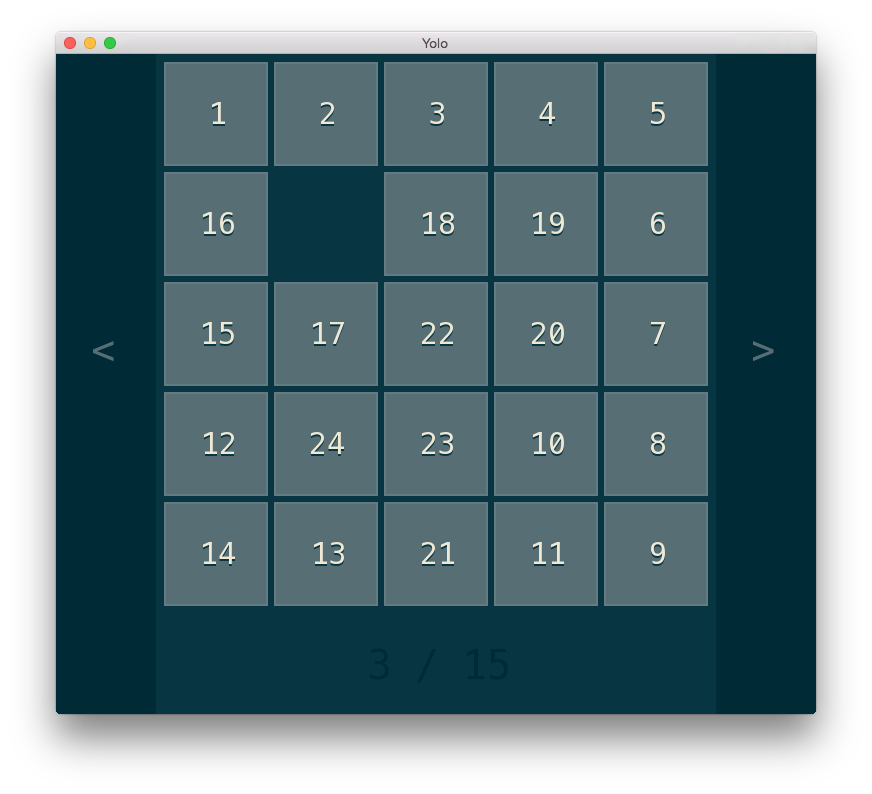

# N-puzzle



## Description

The goal of this project is to solve the N-puzzle game using the A\* search algorithm or one of its variants.

## Install

```
./build.sh
```

## Usage

```
./npuzzle [-f file] [-s size] [-i iterations] [-h <manhattan|hamming|third>] [-u]
```

## Options

```
  -f <file>             Specify a map to run
  -h <heuristic>        Specify heuristic function
  -s <size>             Generate a map with the given size, and run it
  -i <iterations>       Nb of iterations used to generate the map
  -u                    Generate an unsolvable map
```
